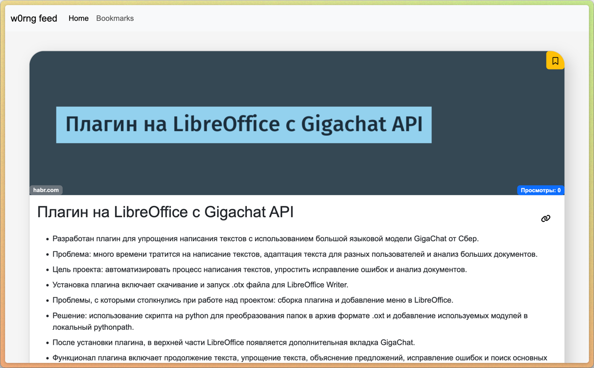
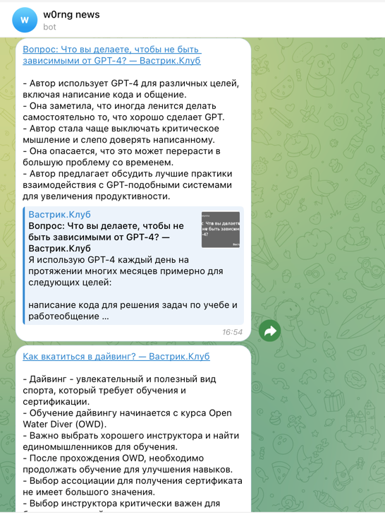

# Сервис сокращенных новостей из RSS-ленты
Добро пожаловать в наш сервис сокращенных новостей из RSS-ленты! Это приложение предоставляет бесконечную ленту новостей, сгенерированную на основе RSS-ленты 300.ya.ru и предлагает краткие сводки новостей.

## Особенности
- Удобный просмотр новостей на веб-сайте (оптимизировано для мобильных устройств)
- Возможность делиться новостями в социальных сетях с предварительным просмотром карточек
- Интеллектуальный алгоритм формирования ленты новостей
- Возможность добавления закладок
- Отслеживание просмотренных новостей
- Генерация кратких сводок новостей
- Отображение видеороликов с YouTube в статьях
- Предоставление сжатых статей через RSS
- Возможность отправки новостей в telegram

## Начало работы
1. Создайте `.env` файл на основе `.env.examle`.  Все необязательные параметры закомментированы.
2. Выполните `docker compose up -d`, чтобы запустить сервис.

## Получение ключа 300.ya.ru API
1. Перейдите на страницу сервиса по ссылке https://300.ya.ru/.
2. Нажмите на "API" в левом нижнем углу.
3. Затем нажмите "Получить токен" в правом верхнем углу.

## Добавление новых лент
1. Создайте суперпользователя django
```bash
docker compose exec -it web sh -c "python manage.py createsuperuser"
```
2. Перейдите в админ-панель по адресу `yourdomain/admin`.
3. Перейдите на вкладку feeds и добавьте ссылки на RSS-ленты, которые вас интересуют.

## Генерация фидов для сайтов
К сожалению, не все сервисы поддерживают RSS. В таких случаях может помочь [RSS Bridge](https://rss-bridge.org/bridge01/). Этот сервис позволяет генерировать ленты для практически любого сервиса. При генерации рекомендуется выбирать формат mrss. Рассмотрите возможность установки собственного экземпляра вместо использования предоставленного.

## Внешний вид



## Участие в разработке
Если вы обнаружите ошибки, не стесняйтесь создавать issues. Также вы можете предложить новые функции, хотя их реализация не гарантируется. Любые вклады в код или помощь в исправлении макета очень ценятся и приветствуются.